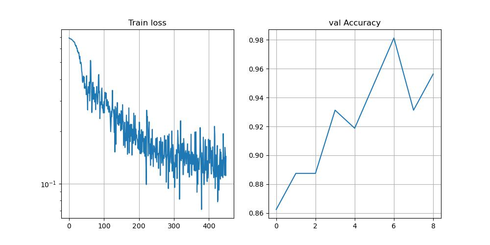

# Task 1. Multiplicate
## Requirements
```
$ pip install absl-py
```
## Running script:
```
python Task1Algorithm/multiplicate.py --input_array=1,2,3,4
```
After ```--input_array``` flag you need to enter values, separated with commas **without any spaces**.

## Description of algorithm
The idea is to solve task in ```O(n)``` space and ```O(1)``` time complexity.
This can be done using running prefix (cumprod until ```i``` element) and suffix (product from ```i = n - 1 to i + 1```) products. That is, multiply left cumprod part (except current element) and right cumprod part (except current element).


# Task 2. Classify noisy speech
**Note. All paths should be absolute.**
Jupyter notebook can be found in Task2Noise_Speech/notebooks.
## Training pipeline
To run train:
```
python Task2Noise_Speech/detect_train.py --speech_dir_train=path_to_train_folder \\
                                         --speech_dir_valid=path_to_valid_folder \\
                                         --num_epochs=5
```
Arguments: \
**--speech_dir_train** - Must have path to train directory (which contains 2 folders: clean and noisy) \
**--speech_dir_valid** - Path to valid directory \
**--num_epochs** - Number of epochs to train on (by default 5) \
**--use_cuda** - To use GPU. By default True and was tested only with GPU

## Inference pipeline
To run prediction process, run:
```
python Task2Noise_Speech/detect_inference.py --files=path_to_folder_with_files_to_check \\
                                             --saved_model=path_to_pth_weights
```
Arguments: \
**--files** - Path to folder with mel `npy` files to classify \
**--saved_model** - Path to checkpoint with pretrained weights (`.pth`)
To download checkpoint with pretrained weights, trained with custom model and for 5 epochs, see section below.

Since simple NN works OK, i did not try anything more complicated (e.g resnet, Unet, CoatNet etc.)
## Pretrained weights
|Weights |
|--------
|[Download from google drive](https://drive.google.com/file/d/1jyVVp9OnPUTnKKp-Y-LlpXX0Qm_fwytI/view?usp=sharing)

## Loss curves (Loss: BinaryCrossEntropy, Metric: Accuracy)
